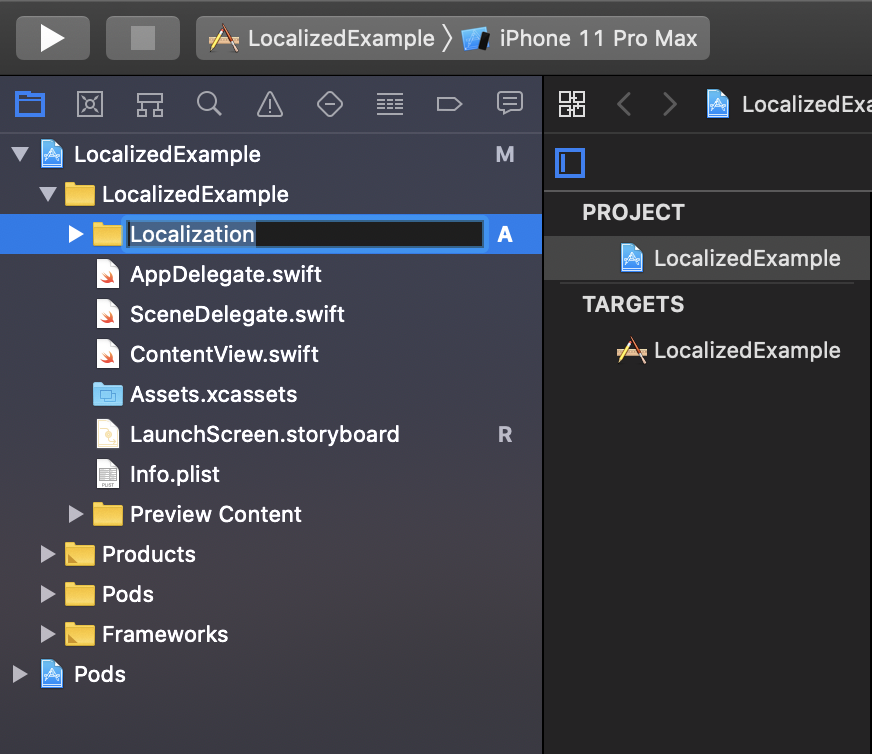
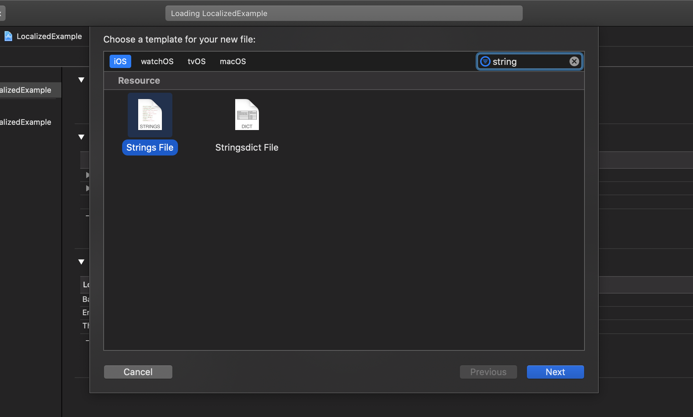
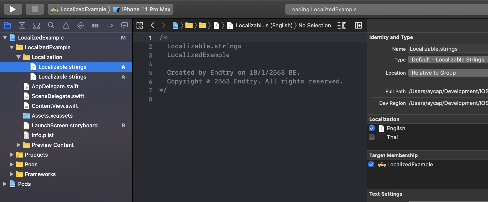
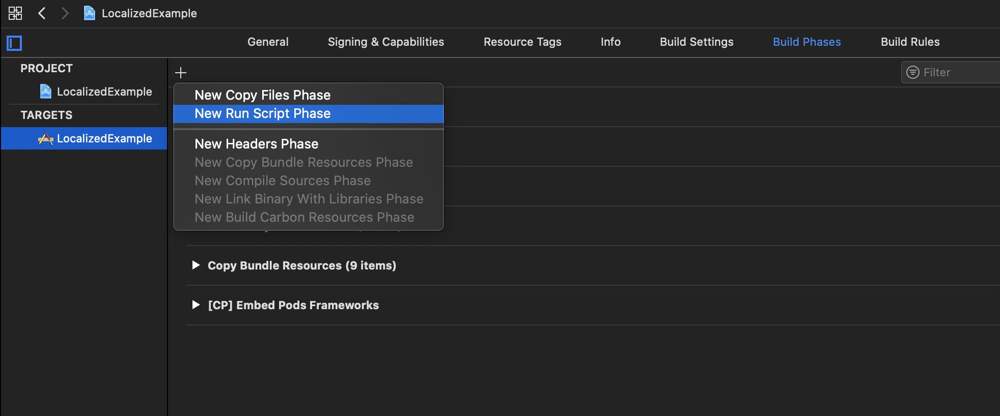
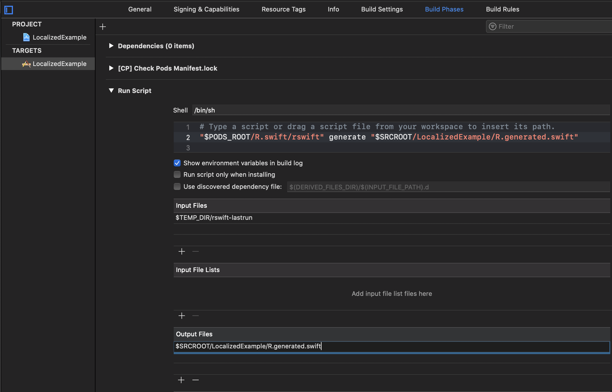

#  IOSLocalizedExample

## Setup R.swift

* Add `Localizations`


* New Group `Localization`



* New String File `Localizable.strings`



* Select `Localize…`



* Add `R.swift` to Podfile

```
pod 'R.swift'
```

* New Run Script Phase



* Drag the new Run Script phase above the Compile Sources phase and below Check Pods Manifest.lock


* Expand Run Script and paste the following script:

```
"$PODS_ROOT/R.swift/rswift" generate "$SRCROOT/[YOUR_PATH]/R.generated.swift"
```


* Add `$TEMP_DIR/rswift-lastrun` to the `Input Files`


* Add `Script` to the `Output Files`

```
$SRCROOT/[YOUR_PATH]/R.generated.swift
```



* Build your project


* Add file to "LocalizedExample"


